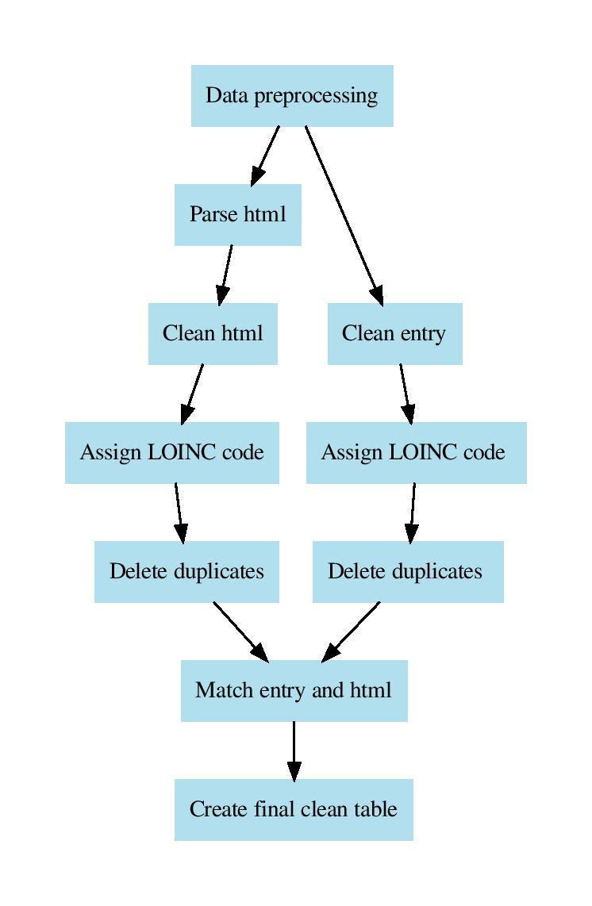

# Cleaning, parsing and joining HTML and ENTRY tables

## Running the whole pipeline

The whole `analysis_data_cleaning` pipeline can be executed with the following commands in terminal.

In first terminal window start luigi daemon
```
luigid
```

In the second terminal window execute (define own prefix and configuration file)
```
export PYTHONPATH=~/Repos/cda-data-cleaning:$PYTHONPATH

prefix="run_201909261208"
conf="configurations/egcut_epi_microrun.example.ini"

luigi --scheduler-port 8082 --module cda_data_cleaning.data_cleaning.analysis_data_cleaning.run_analysis_data_cleaning RunAnalysisDataCleaning --prefix=$prefix --config=$conf --workers=1 --log-level=INFO
```
For output tables to be without prefix, just remove ```prefix=$prefix``` from the previous command.

Under folder [delete_all_tables](https://git.stacc.ee/project4/cda-data-cleaning/tree/master/cda_data_cleaning/data_cleaning/analysis_data_cleaning/delete_all_tables)
is luigi workflow which can be used for deleting all the tables created with running the previous command.

Visual overview of the pipeline steps



## Step00 Create cleaning functions
Create postgresql functions for cleaning
- `analysis_name_raw`
- `parameter_name_raw `
- `effective_time_raw`
- `reference_values_raw`
- `value_raw`


## Step01 Create and clean analysis entry

Copy from previous [pipeline](https://git.stacc.ee/project4/cda-data-cleaning/blob/master/analysis_html_parsing/step01_create_entry_table.py). Uses sqlalchemy. 


Applies cleaning functions to entry table and
the results are stored in `*_analysis_entry_cleaned`.

Assumptions: analysis_entry table has columns
- `analysis_name_raw`
- `parameter_name_raw `
- `effective_time_raw`
- `reference_values_raw`  
- `value_raw`

Creates new cleaned columns
- `analysis_name`
-  `parameter_name` 
- `reference_values`
-  `effective_time`
-  `value`


## Step02 Creates, parses and cleans analysis HTML

Creates empty tables named
* `*_analysis_html`
* `*_analysis_html_log ` 
* `*_analysis_html_meta `  

Parses HTML table by filling the previously created table.

Next step is cleaning the table which is stored in table 
`*_analysis_html_cleaned`.

For cleaning HTML table there are some assumptions.
Assumptions: analysis_html table has columns
- `analysis_name_raw`
- `parameter_name_raw `
- `effective_time_raw`
- `reference_values_raw`  
- `value_raw`

Creates new cleaned columns
- `analysis_name`
-  `parameter_name` 
- `reference_values`
-  `effective_time`
-  `value`


## Step03 applies LOINC mapping and deletes duplicates

### LOINC mapping 
Location is [shared_workflows](https://git.stacc.ee/project4/cda-data-cleaning/tree/master/cda_data_cleaning/shared_workflows/loinc_cleaning).

First, maps LOINC code based on `analysis_name`,
`parameter_name` and `parameter_unit` 
to `*_analysis_entry_loinced` and `*_analysis_html_loinced` .

New columns:
- `loinc_code`
- `t_lyhend`
- `parameter_unit` (cleaned parameter_unit_raw)
- `loinc_unit`
- `substrate`


### Deletes duplicate rows
Secondly, if some row exists multiple times, then only one is kept and the others are deleted (more detalis in [here](https://git.stacc.ee/project4/cda-data-cleaning/tree/master/cda_data_cleaning/data_cleaning/analysis_data_cleaning/step03_delete_duplicates)).

The results are stored in
 * `*_analysis_entry_loinced_unique`
* `*_analysis_html_loinced_unique` .

## Step 04 Matches HTML and ENTRY tables and creates the final table

Firstly, matches HTML and entry rows and stores them in one table called  `*_analysis_matched`.

Secondly, creates the final table  `*_analysis_cleaned` where entry and html are joined. More detailed description of the table [here](https://git.stacc.ee/project4/cda-data-cleaning/tree/master/cda_data_cleaning/data_cleaning/analysis_data_cleaning/step04_match_entry_and_html).

## Step 05 summarise final table

Creates a summary of the table `*_analysis_cleaned`
as `*_analysis_cleaned_summary`.
More detailed description of the table [here](https://git.stacc.ee/project4/cda-data-cleaning/tree/master/cda_data_cleaning/data_cleaning/analysis_data_cleaning/step05_summarise).
