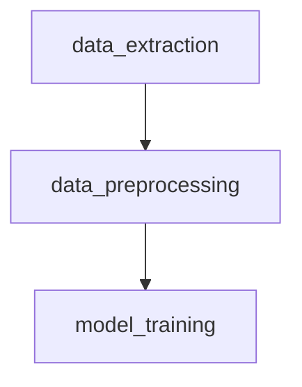

This is the pipeline to create necessary files for the Collocation Net. The order for the folders to be run is the following.

Under `data_preprocessing` there are separate Jupyter Notebook files corresponding to the different types of Collocation Nets. Each results in files for that specific collocation type.

Under `model_training` there are three different folders. The `parameter_selection` folder shows the finding of optimal number of topics. These files are not necessary to run for the pipeline to work however may be useful if the used data is different. The `parameters` folder has csv-files with the optimal number of topics for each collocation net obtained from the parameter selection. The file `lda.py` under `final_model` can be used to train the LDA model. It can be run from the commandline with three arguments. The command should be: "python lda.py path_to_lda_data collocation_type result_path" where path_to_lda_data is the path to the matrix used to train the LDA model and collocation_type specifies the type of collocation and has to match with one of the filenames under the `parameters` folder (ie subject_verb).
