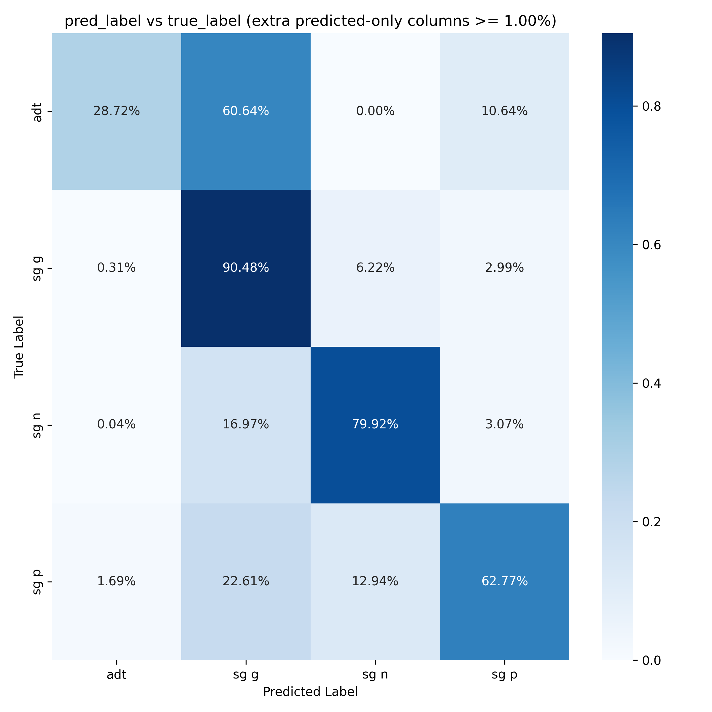
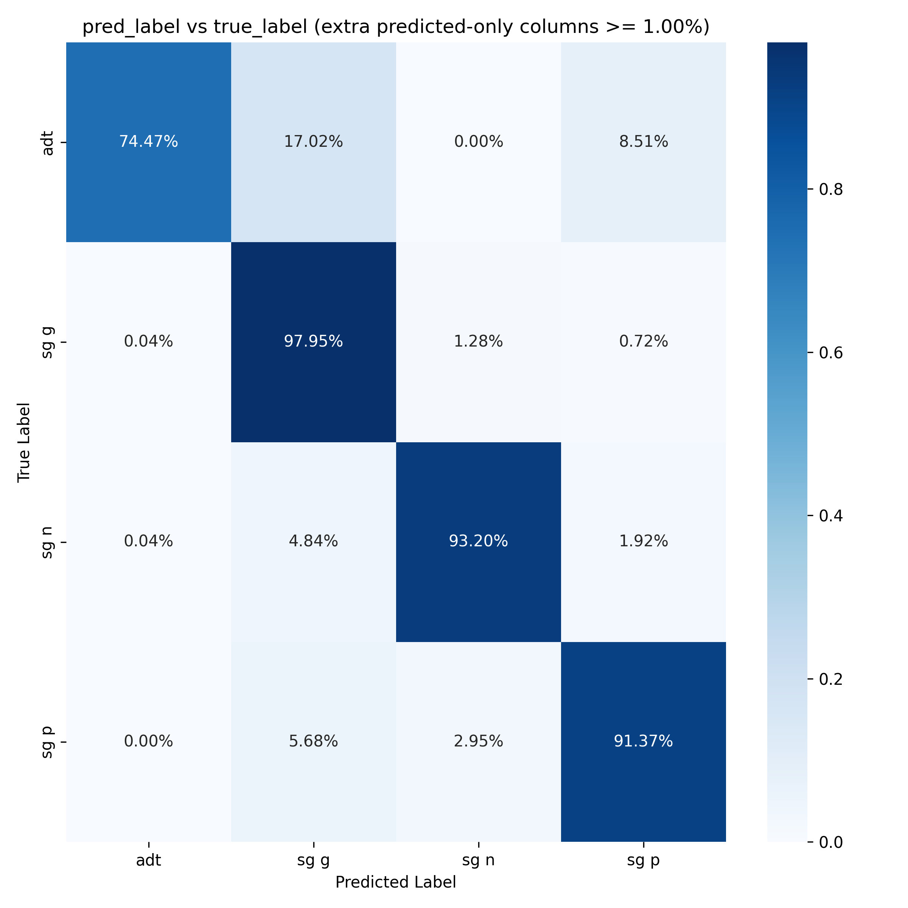
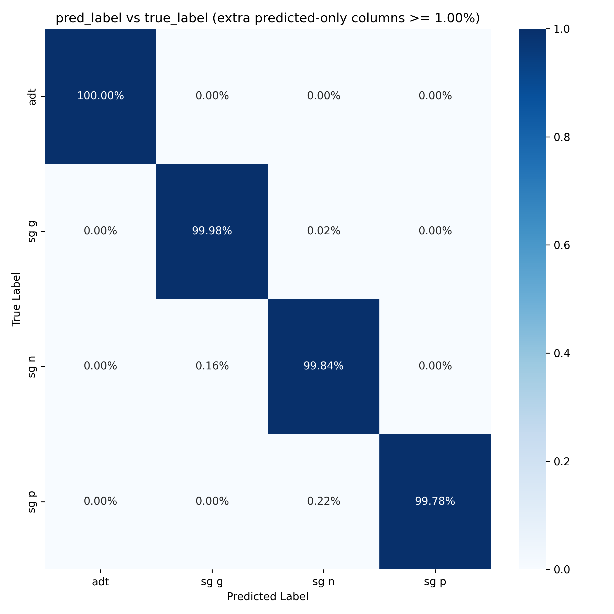

## Homonymous word form tagging with BERT-based morph analysis and disambiguation model

### Problem statement

Vabamorf's standard disambiguator struggles with identifying homonymous word forms, which creates anomalies in the case profiles of words calculated by Institute of the Estonian Language (EKI).

<figure>

<figcaption><i>Confusion matrix for Vabamorf's standard disambiguator on the homonymous word form dataset.</i></figcaption>
</figure>

On the other hand, a BERT-based morph analysis and disambiguation model trained on UD treebank (Bert_morph_v2) performs better, but still has worse performance on the homonymous word form dataset compared to the average.

<figure>

<figcaption><i>Confusion matrix for BERT-based model trained on UD treebank (Bert_morph_v2) on the homonymous word form dataset.</i></figcaption>
</figure>

In addition, the overall performance of the BERT-based model on the Estonian National Corpus 2017 (ENC2017) test dataset also drops.

<!-- **Evaluation results on ENC2017 test dataset**

| Model                          |   Accuracy |  Precision |     Recall |   F1-score |
| ------------------------------ | ---------: | ---------: | ---------: | ---------: |
| **Bert_morph_v1**              | **95.62%** | **95.44%** | **95.62%** | **95.50%** |
| Bert_morph_v2                  |     87.51% |     88.64% |     87.51% |     87.68% | -->

<table>
<caption><i>Evaluation results on ENC2017 test dataset.</i></caption>
  <tr>
    <th>Model</th>
    <th>Accuracy</th>
    <th>Precision</th>
    <th>Recall</th>
    <th>F1-score</th>
  </tr>
    <tr>
        <td><b>Bert_morph_v1</b></td>
        <td><b>95.62%</b></td>
        <td><b>95.44%</b></td>
        <td><b>95.62%</b></td>
        <td><b>95.50%</b></td>
    </tr>
    <tr>
        <td>Bert_morph_v2</td>
        <td>87.51%</td>
        <td>88.64%</td>
        <td>87.51%</td>
        <td>87.68%</td>
    </tr>
</table>

### Suggested solutions

Possible solutions are:

**A.** A mixture of experts (MOE) model that uses a specialized expert model for homonymous word form disambiguation.
**B.** A general model that is trained on a combination of datasets such that the overall performance remains the same while the performance on homonymous word form disambiguation improves.

### Workflow description

1. **Data preparation**: Collect and preprocess different datasets. This includes gathering data, cleaning it, possibly adding annotations, formatting it for training, and splitting it into training, validation, and test sets.
2. **Model training**: Train the BERT-based morph analysis and disambiguation model on the prepared datasets. This involves selecting appropriate hyperparameters, monitoring training progress, and evaluating the model on validation data.
3. **Evaluation**: Assess the model's performance on the test datasets. This includes calculating metrices, analyzing confusion matrices, checking some sample outputs, and comparing the results between the different models and datasets.
4. **Iteration**: Based on the evaluation results, make necessary adjustments to the model or the training process. This could involve changing the dataset composition, tweaking hyperparameters, or even modifying the model architecture. The process is iterative and may require several rounds of training and evaluation to achieve the desired performance.

### Achieved results

A mixture of experts (MOE) model that uses a specialized expert model for homonymous word form disambiguation has been implemented and trained.

An expert model trained on the homonymous word form dataset has been added to the BERT-based morph analysis and disambiguation model (Bert_morph_v2) using a simple gating mechanism based on the presence of homonymous word forms in the input.

<figure>

<figcaption><i>Confusion matrix for BERT-based MOE model on the homonymous word form dataset.</i></figcaption>
</figure>

The results show an improvement in the performance on the homonymous word form dataset.

<table>
<caption><i>Evaluation results on different datasets for the BERT-based models.</i></caption>
  <tr>
    <th colspan="5">UD treebank</th>
  </tr>
    <tr>
      <th>Model</th>
      <th>Accuracy</th>
      <th>Precision</th>
      <th>Recall</th>
      <th>F1-score</th>
    </tr>
      <tr>
        <td>Bert_morph_v2</td>
        <td>97.66%</td>
        <td>97.60%</td>
        <td>97.66%</td>
        <td>97.61%</td>
      </tr>
      <tr>
        <td><b>Bert_morph_v2_homonym_full</b></td>
        <td><b>97.47%</b></td>
        <td><b>97.41%</b></td>
        <td><b>97.47%</b></td>
        <td><b>97.39%</b></td>
      </tr>
  <tr>
    <th colspan="5">Homonymous word form dataset</th>
  </tr>
    <tr>
      <th>Model</th>
      <th>Accuracy</th>
      <th>Precision</th>
      <th>Recall</th>
      <th>F1-score</th>
    </tr>
      <tr>
        <td>Bert_morph_v2</td>
        <td>92.53%</td>
        <td>93.85%</td>
        <td>92.53%</td>
        <td>92.98%</td>
      </tr>
      <tr>
        <td><b>Bert_morph_v2_homonym_full</b></td>
        <td><b>99.54%</b></td>
        <td><b>99.99%</b></td>
        <td><b>99.54%</b></td>
        <td><b>99.76%</b></td>
      </tr>
</table>

While also maintaining the overall performance on the UD treebank test dataset similar to the BERT-based model trained only on the UD treebank.

<!-- TODO: Add links to the models -->
