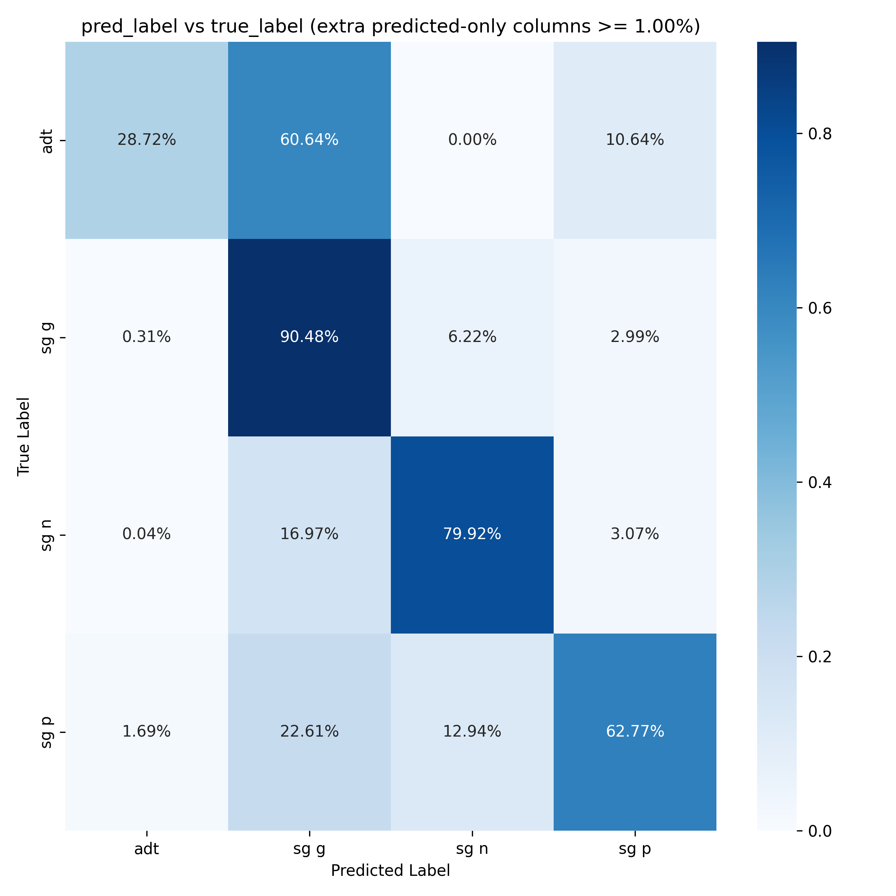
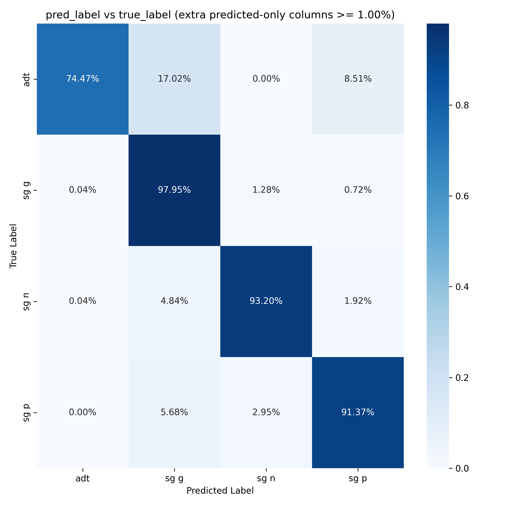
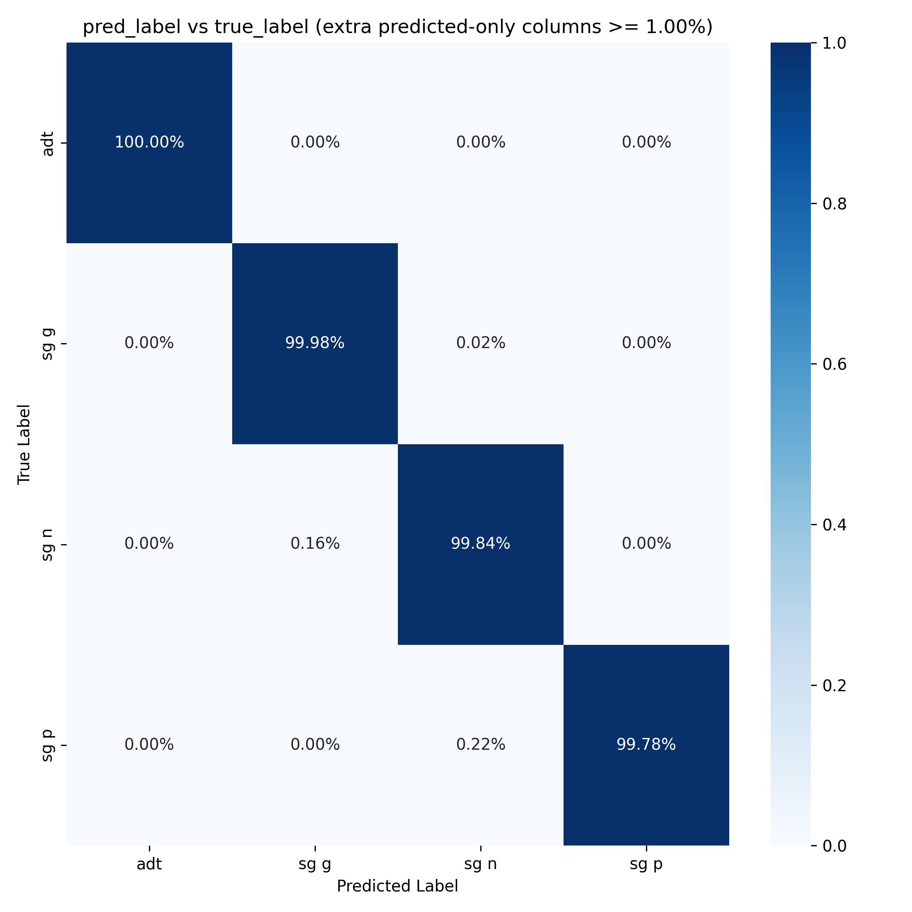

## Homonymous word form tagging with BERT-based morph analysis and disambiguation model

### Problem statement

Vabamorf's standard disambiguator struggles with identifying homonymous word forms, which creates anomalies in the case profiles of words calculated by Institute of the Estonian Language (EKI).

<figure>

<figcaption><i>Confusion matrix for Vabamorf's standard disambiguator on the homonymous word form dataset.</i></figcaption>
</figure>

On the other hand, a BERT-based morph analysis and disambiguation model trained on UD treebank (Bert_morph_v2) performs better, but still has worse performance on the homonymous word form dataset compared to the average.

<figure>

<figcaption><i>Confusion matrix for BERT-based model trained on UD treebank (Bert_morph_v2) on the homonymous word form dataset.</i></figcaption>
</figure>

In addition, the overall performance of the BERT-based model on the Estonian National Corpus 2017 (ENC2017) test dataset also drops.

<table>
<caption><i>Evaluation results on ENC2017 test dataset. Figures are macro-averaged.</i></caption>
  <tr>
    <th>Model</th>
    <th>Accuracy</th>
    <th>Precision</th>
    <th>Recall</th>
    <th>F1-score</th>
  </tr>
      <tr>
        <td><b>Bert_morph_v1</b></td>
        <td><b>96.92%</b></td>
        <td><b>88.62%</b></td>
        <td><b>88.52%</b></td>
        <td><b>88.44%</b></td>
      </tr>
      <tr>
        <td>Bert_morph_v2</td>
        <td>91.92%</td>
        <td>77.28%</td>
        <td>77.24%</td>
        <td>75.58%</td>
      </tr>
</table>

### Suggested solutions

Possible solutions are:

**A.** A mixture of experts (MOE) model that uses a specialized expert model for homonymous word form disambiguation.
**B.** A general model that is trained on a combination of datasets such that the overall performance remains the same while the performance on homonymous word form disambiguation improves.

### Workflow description

1. **Data preparation**: Collect and preprocess different datasets. This includes gathering data, cleaning it, possibly adding annotations, formatting it for training, and splitting it into training, validation, and test sets.
2. **Model training**: Train the BERT-based morph analysis and disambiguation model on the prepared datasets. This involves selecting appropriate hyperparameters, monitoring training progress, and evaluating the model on validation data.
3. **Evaluation**: Assess the model's performance on the test datasets. This includes calculating metrices, analyzing confusion matrices, checking some sample outputs, and comparing the results between the different models and datasets.
4. **Iteration**: Based on the evaluation results, make necessary adjustments to the model or the training process. This could involve changing the dataset composition, tweaking hyperparameters, or even modifying the model architecture. The process is iterative and may require several rounds of training and evaluation to achieve the desired performance.

### Running the workflow

The scripts in this directory reproduce the expert model, in order. They depend on
`estnltk`, `estnltk_neural`, `transformers`, `torch`, `pandas` and `evaluate`.

The word form homonymy corpus is not in this repository; it is available from the
University of Tartu's OwnCloud share referenced in the training repository this work
came from.

**1. Pick sentences to annotate.** Samples 1000 sentences for each of the target
inflection types (1, 16, 17 and 19) out of the extracted sentences containing
homonymous word forms.

```
python 01_pick_sentences.py --help
```

**2. Export them as annotation tasks.** Converts each pick into a Label Studio
import file, one subdirectory per pick.

```
python 02_export_to_labelstudio.py --help
```

Annotators then disambiguate the marked word in each sentence, and the completed
projects are exported back out as JSON.

**3. Build the training data.** Turns the exported annotations into token-level rows
and splits them by sentence.

```
python 03_build_training_data.py \
    --annotations-dir from_labelstudio \
    --output-dir      data \
    --test-size 0.2
```

Only the annotated homonymous word carries a real label; every other token is
labelled `-`.

**4. Fine-tune the expert.** Continues training a general BERT-based morphological
tagger on that data. `--base-model` takes a checkpoint directory or an EstNLTK
resource name, which is downloaded if missing.

```
python 04_finetune_expert.py \
    --train-set  data/homonyms_train.parquet \
    --eval-set   data/homonyms_test.parquet \
    --labels     ../unique_labels.json \
    --base-model bert_morph_v2 \
    --output-dir models/homonym_expert
```

Placeholder labels are ignored by default, for the reason given in step 3. Add
`--dry-run` to exercise the whole loop without writing model files.

**5. Evaluate.** One model, or two in mixture-of-experts mode, where the second model
is consulted for sentences whose homonym density passes `--density-threshold`.

```
python 05_evaluate.py \
    --test-set   data/homonyms_test.parquet \
    --model-path models/homonym_expert

python 05_evaluate.py \
    --test-set          UD_edt_test.parquet \
    --model-path        models/bert_morph_v2 \
    --second-model-path models/homonym_expert \
    --homonym-list-path homonymous_words.txt
```

Figures reported here are macro-averaged, which is the default.

The retagger that applies this expert to Vabamorf's output inside EstNLTK is
`VabamorfMorphHomonymsRetagger`, in `estnltk_neural`.

### Achieved results

A mixture of experts (MOE) model that uses a specialized expert model for homonymous word form disambiguation has been implemented and trained.

An expert model trained on the homonymous word form dataset has been added to the BERT-based morph analysis and disambiguation model (Bert_morph_v2) using a simple gating mechanism based on the presence of homonymous word forms in the input.

<figure>

<figcaption><i>Confusion matrix for BERT-based MOE model on the homonymous word form dataset.</i></figcaption>
</figure>

The results show an improvement in the performance on the homonymous word form dataset.

<table>
<caption><i>Evaluation results on different datasets for the BERT-based models. Figures are macro-averaged.</i></caption>
  <tr>
    <th colspan="5">UD treebank</th>
  </tr>
    <tr>
      <th>Model</th>
      <th>Accuracy</th>
      <th>Precision</th>
      <th>Recall</th>
      <th>F1-score</th>
    </tr>
      <tr>
        <td>Vabamorf</td>
        <td>90.64%</td>
        <td>79.05%</td>
        <td>77.15%</td>
        <td>77.01%</td>
      </tr>
      <tr>
        <td>Bert_morph_v2</td>
        <td>98.30%</td>
        <td>92.84%</td>
        <td>93.01%</td>
        <td>92.42%</td>
      </tr>
      <tr>
        <td>Bert_morph_v2_homonym_full (expert alone)</td>
        <td>82.22%</td>
        <td>87.01%</td>
        <td>67.77%</td>
        <td>71.88%</td>
      </tr>
      <tr>
        <td>Bert_morph_v2_homonym_full_finetune (expert alone)</td>
        <td>98.07%</td>
        <td>93.91%</td>
        <td>91.71%</td>
        <td>92.59%</td>
      </tr>
      <tr>
        <td><b>MoE (Bert_morph_v2 + Bert_morph_v2_homonym_full_finetune)</b></td>
        <td><b>98.26%</b></td>
        <td><b>92.87%</b></td>
        <td><b>92.78%</b></td>
        <td><b>92.31%</b></td>
      </tr>
  <tr>
    <th colspan="5">Homonymous word form dataset</th>
  </tr>
    <tr>
      <th>Model</th>
      <th>Accuracy</th>
      <th>Precision</th>
      <th>Recall</th>
      <th>F1-score</th>
    </tr>
      <tr>
        <td>Vabamorf</td>
        <td>84.75%</td>
        <td>76.38%</td>
        <td>66.25%</td>
        <td>69.76%</td>
      </tr>
      <tr>
        <td>Bert_morph_v2</td>
        <td>95.12%</td>
        <td>55.02%</td>
        <td>49.96%</td>
        <td>52.05%</td>
      </tr>
      <tr>
        <td>Bert_morph_v2_homonym_full (expert alone)</td>
        <td>99.94%</td>
        <td>99.95%</td>
        <td>99.86%</td>
        <td>99.90%</td>
      </tr>
      <tr>
        <td>Bert_morph_v2_homonym_full_finetune (expert alone)</td>
        <td>99.94%</td>
        <td>99.97%</td>
        <td>99.95%</td>
        <td>99.96%</td>
      </tr>
      <tr>
        <td><b>MoE (Bert_morph_v2 + Bert_morph_v2_homonym_full_finetune)</b></td>
        <td><b>99.94%</b></td>
        <td><b>99.97%</b></td>
        <td><b>99.95%</b></td>
        <td><b>99.96%</b></td>
      </tr>
</table>


> **A note on the model names and the figures.** In an earlier version of this
> table the row labelled `Bert_morph_v2_homonym_full` reported the *mixture of
> experts*, not the expert model on its own. The two are now listed separately,
> because they behave very differently outside the homonymy dataset: the expert
> alone drops to 82.22% on the UD treebank, a case of catastrophic forgetting
> from specialising on homonymous forms, which is why it is published for use as
> an expert component rather than as a stand-alone tagger. The mixture of experts
> recovers the baseline's accuracy while keeping the expert's advantage on
> homonymous word forms.
>
> All figures are **macro-averaged** rather than weighted, which is the more
> informative choice for this heavily imbalanced label set. The underlying
> numbers are in `evaluation_results.json` in this directory, which also covers
> the development splits and the 50% and 80% homonymy-data ablations not shown
> here.

While also maintaining the overall performance on the UD treebank test dataset similar to the BERT-based model trained only on the UD treebank.

<!-- TODO: Add links to the models -->
