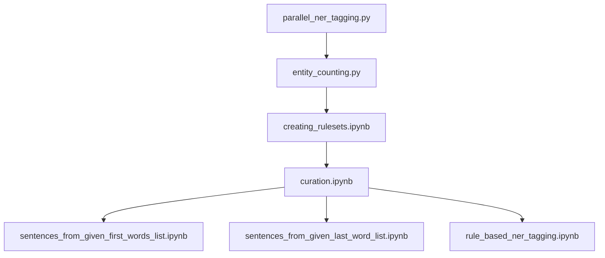
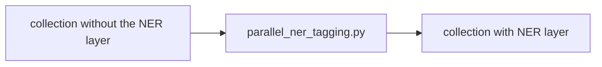
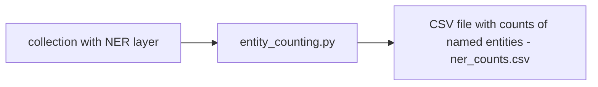
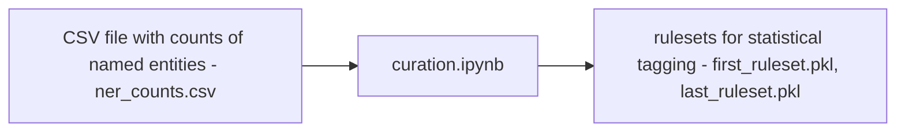
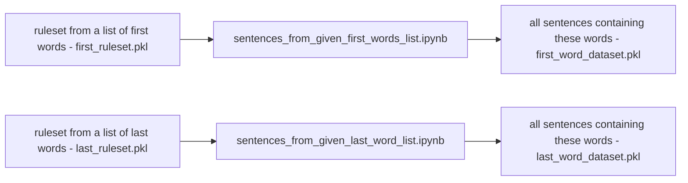
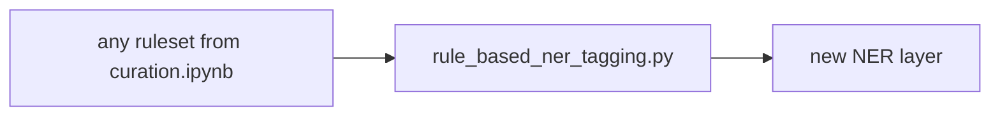

This module has a pipeline for using statistical methods with rule-based taggers to do NER tagging.
It also includes comparison to the existing NER tagger in EstNLTK.
The following diagram describes the workflow:

### parallel_ner_tagging.py
uses parallel computing on EstNLTK collections to apply the NER tagger on a large corpus.
Here it is applied on Koondkorpus but it can be used on other corpora as well.

### entity_counting.py
aggregates the data from the NER tagging file to CSV files
  divided by if the entity is composed of multiple tokens or one and for multiple
  tokens it separates the last tokens and all preceding tokens.

### curation.ipynb
shows how these count lists can be used to create rulesets for
  statistical tagging

### sentences_from_given_first_words_list.ipynb, sentences_from_given_last_word_list.ipynb

  create a list of EstNLTK text objects, each containing one sentence, where any
  of the given words in a list exists.

### rule_based_ner_tagging.py
uses the curated rulesets to perform statistical ner
  tagging

### workflow_config.ini 
contains the configuration for all the files used here.
