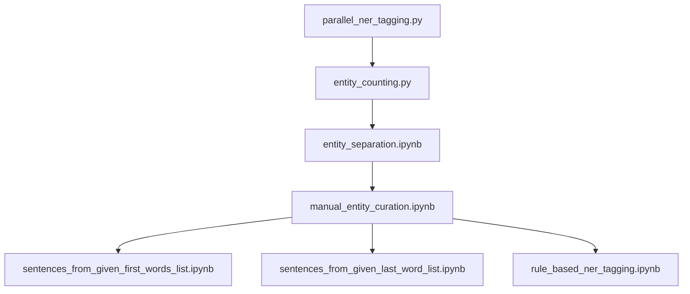
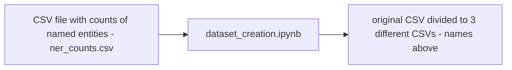
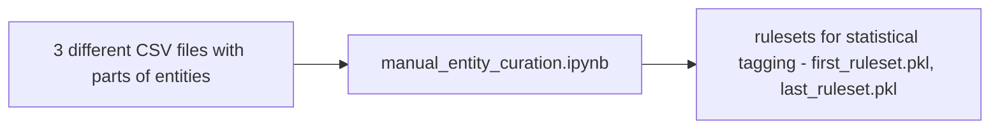
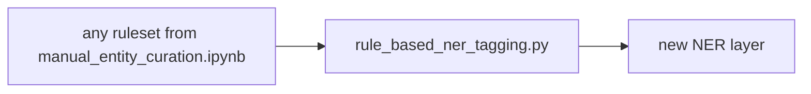

This module has a pipeline for using statistical methods with rule-based taggers to do NER tagging.
It also includes comparison to the existing NER tagger in EstNLTK.
All .py files can be found in the scripts folder and notebooks in notebooks/pipeline.
The following diagram describes the workflow:

### parallel_ner_tagging.py
Uses parallel computing on EstNLTK collections to apply the NER tagger on a large corpus.
Here it is applied on Koondkorpus but it can be used on other corpora as well.

### entity_counting.py
Aggregates the data from the NER tagging file to CSV files
  divided by if the entity is composed of multiple tokens or one and for multiple
  tokens it separates the last tokens and all preceding tokens.

### entity_separation.ipynb
Takes the CSV file from the previous step and separates the data into three 
CSV-s: one for singletons (entities with just one word), one for the first words
(all but the last word of multiword entities) and one for the last words (last
word of multiword entities)

### manual_entity_curation.ipynb
Applying different filters to the lists of entities produced in the previous step and then
creating rulesets based on the filtered lists.

### sentences_from_given_first_words_list.ipynb, sentences_from_given_last_word_list.ipynb

  Create a list of EstNLTK text objects, each containing one sentence, where any
  of the given words in a list exists.

### rule_based_ner_tagging.py
Using the curated rulesets to perform statistical NER tagging

### workflow_config.ini 
Contains the configuration for all the files used here.
